This is a tutorial of the project "Provisioning an EC2 Instance using Terraform". The goals of the project are to have an EC2 instance created using Terraform scripts and then SSH into the instance to install Java, Python and Jenkins.

## Install Terraform

To begin with, we first need to install gnupg and software-properties-common, if not already present. This step follows the instructions mentioned in the official Terraform documentation.

```bash
sudo apt-get update
```
```bash
sudo apt-get install -y gnupg software-properties-common
```

After installing these, we need to add the HashiCorp GPG Key to the Ubuntu system.

```bash
wget -O- https://apt.releases.hashicorp.com/gpg | \
gpg --dearmor | \
sudo tee /usr/share/keyrings/hashicorp-archive-keyring.gpg
```

Now, let's go ahead and add the HashiCorp repository to Ubuntu. This repository will allow us to find the Terraform software on the internet.

```bash
echo "deb [signed-by=/usr/share/keyrings/hashicorp-archive-keyring.gpg] \
https://apt.releases.hashicorp.com $(lsb_release -cs) main" | \
sudo tee /etc/apt/sources.list.d/hashicorp.list
```

And finally, it's time to install Terraform itself.

```bash
sudo apt-get update
```
```bash
sudo apt-get install terraform
```

After completion, I verified if the installation was successful using this command:

```bash
terraform --version
```
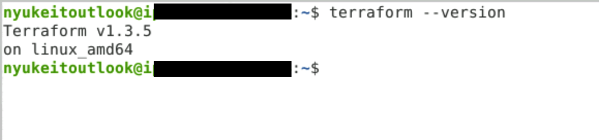

Now that Terraform is installed, it was time to install AWSCLI, the utility to configure our AWS with credentials.

## Install AWSCLI

Although there are a few ways to install AWSCLI, I used the method prescribed in the official documentation by Amazon.

```bash
curl "https://awscli.amazonaws.com/awscli-exe-linux-x86_64.zip" -o "awscliv2.zip"
unzip awscliv2.zip
sudo ./aws/install
```

Once again, I verified the successfull installation of AWSLI by checking its version by typing in the following command:

```bash
aws --version
```
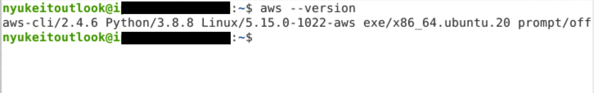

## AWS Credentials

I already had an AWS account created, by means of the Simplilearn Portal, along with an access token already available in the portal. 

Now in the terminal, we type the following command

```bash
aws configure
```

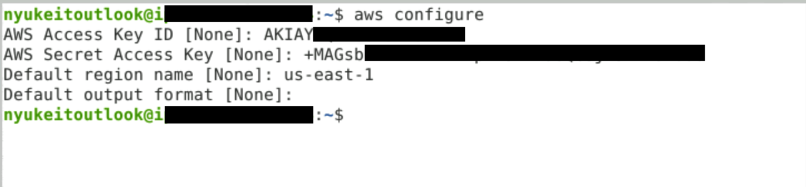

AWS presents us with options to paste/type the following one by one. Press enter after pasting in each line. Note that [none] means there is no data configured for that key yet.

```bash
Access Key [none]: <paste access key here>

Secret Key [none]: <paste secrete key here>

Region [none]: us-east-1

Output format [none]: <leave this blank>
```

Now we have our AWSCLI configured to access the AWS account, however, this is not enough to launch an EC2 instance. For that, we need a keypair.

Sidenote: This article makes use of the root account in AWS and does not consider any security viewpoint. Creating an IAM user account and using permission boundaries is generally suggested.

Again, we confirm everything is in place by verifying. Seeing is believing.

```bash
cd /.aws
```
```bash
cat credentials
```
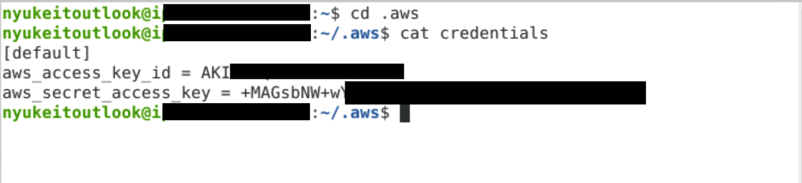

## EC2 Keypair

In AWS dashboard, go to EC2 and on the left navigation, go to Keypair. Click on Create.

Give a suitable name to the keypair file and select RSA and PEM and click on Save. This will download the PEM file to the system.

In terminal, I created a folder for my project called 'ec2tf'.

```bash
mkdir ec2tf
```

I wasn't able to move the downloaded PEM file to the lab system directly. So I created the PEM file inside the terminal and pasted the contents of the downloaded file.

```bash
sudo nano ec2tf.pem
```

Now we will change the permissions of this key file, without which EC2 will reject our connection.

```bash
sudo chmod 400 ec2tf.pem
```
We will use this keypair file to ssh into the newly created EC2 Instance.

## Creating Terraform Scripts

Now that we have the prerequisites in place, let's create a Terraform plan and apply it to create our instance.

```bash
cd myproject
```

Once inside your the folder, I created the Terraform creds file which will contain the same credentials that we used for AWSCLI

```bash
sudo nano creds.tf
```

```yaml
provider "aws" {
	access_key = "<your aws access key>"
	secret_key = "<your aws secret key"
	region = "<your aws region>"
}
```

Now it's time to create the main Terraform script that will actually execute the commands to launch our EC2 instance.

```bash
sudo nano main.tf
```

```yaml
resource "aws_instance" "myproject" {
	ami = "ami-2757f631"
	instance_type = "t2.micro"
	key_name = "ec2tf"
}
```

NOTE: I tried searching for other Amazon Machine Images (AMI) that corresponded to the type T2.Micro but I wasn't able to. Hence, I went ahead using the AMI ID mentioned in the Projects documentation downloaded from the portal for Course 2.

We now have the Terraform plan ready and we need to initiate it.

```bash
terraform init
```
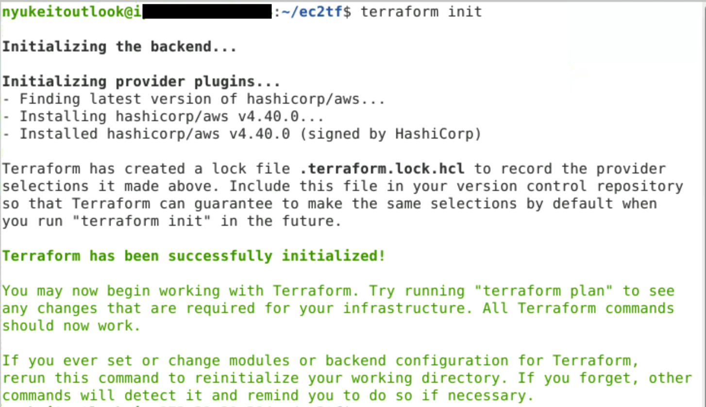

Once the configuration is initialized, we need to apply it for Terraform to create our EC2 instance.

```bash
terraform apply
```
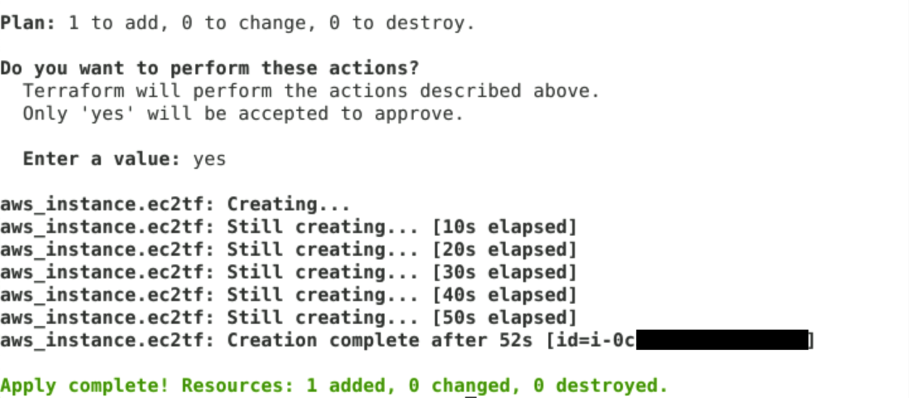

When prompted, type **yes**

Terraform will now begin to create the EC2 instance. This took up to a minute and a half to finish depending on the image.

To verify the creation of the instance, I went to my EC2 dashboard and I could see my newly created instance in the running state.

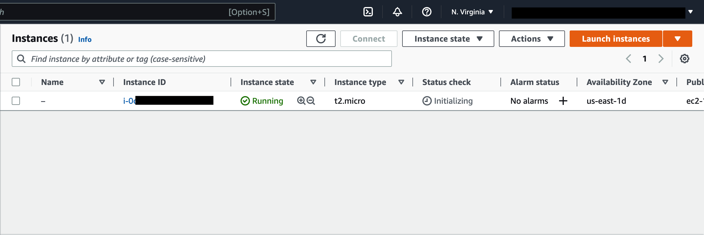

## Connecting to EC2 Instance using SSH

The reason why I initiated my instance using a keypair file was to be able to SSH into it after creation. And we will see how this became very easy now.

The first step is to go to the EC2 dashboard and click on **Security Groups**.

There, select the security group and click on **Inbound Rules** tab. Click on Edit Inbound Rules

There was a default rule already added.

Click on **Add Rule** and select the protocol as **SSH** and source as **Custom**. Click on the search box next to Custom and select **0.0.0.0/0** and save the rule.

My EC2 instance was now ready to accept incoming SSH connections.

Before moving ahead, I needed the public IPv4 DNS address of my instance. I found this be going to Instances in the EC2 dashboard and selecting my running instance.

Now to login to the EC2 instance, we type the following

```bash
sudo ssh -i "ec2tf.pem" ubuntu@ip4-public-dns
```

Note: I found that Amazon AWS has default usernames for AMIs based on the type of image which can be found on [here](https://docs.aws.amazon.com/AWSEC2/latest/UserGuide/connection-prereqs.html) 

When prompted, type **yes**.

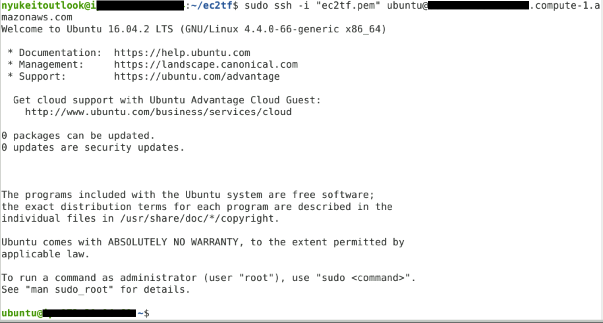

With this, I successfully logged in to my new EC2 instance using SSH. Now it was time to install Java, Python and Jenkins.

## Installing Java

The step that I had thought was the most straightforward actually turned up a small challenge. Jenkins requires Java to run, so I had to install java first. The official documentation of Jenkins mentions installing openjdk-11-jre but I could not come around to install this.

Trying the other method of installing default-jre was installing an older version of Java which was incompatible with Jenkins.

Thus, I had to search for a PPA to work around this.

```bash
sudo add-apt-repository ppa:openjdk-r/ppa
```
```bash
sudo apt-get update
```
```bash
sudo apt install openjdk-11-jdk
```
Now, we verify the java version installed.

```bash
java -version
```
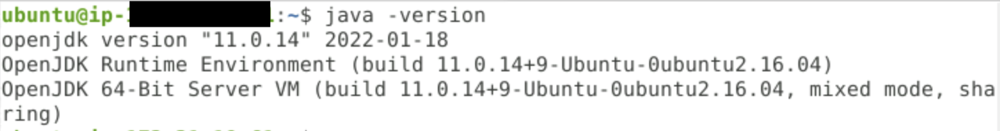

## Installing Python

Python comes pre-installed in Ubuntu 16.04, so I had to only upgrade it from the current version to the latest version. This was checked using

```bash
python3 --version
```
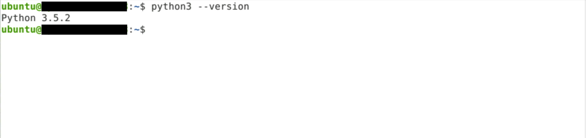

To upgrade, I used the apt package manager.

```bash
sudo apt upgrade python3
```
And finally, it was time to install Jenkins.

## Installing Jenkins

Since we already installed Java, we can now proceed to installing Jenkins. We first add the key and repository to fetch the Jenkins installer. 

```bash
curl -fsSL https://pkg.jenkins.io/debian-stable/jenkins.io.key | sudo tee \
  /usr/share/keyrings/jenkins-keyring.asc > /dev/null
```
```bash
echo deb https://pkg.jenkins.io/debian-stable binary/ | sudo tee /etc/apt/sources.list.d/jenkins.list
```
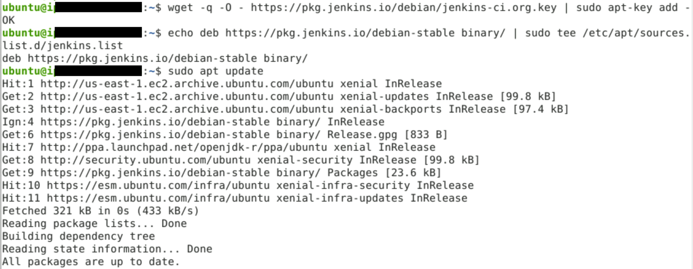

Now we update the repository list.

```bash
sudo apt-get update
```
And finally, installing Jenkins.

```bash
sudo apt-get install jenkins
```
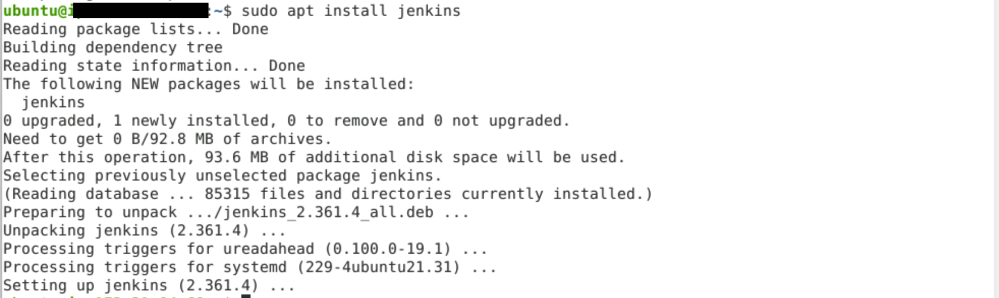

Once Jenkins is installed, we verify the installation using

```bash
sudo systemctl status jenkins.service
```
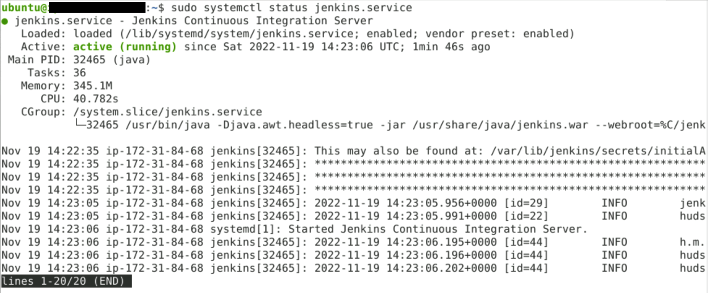

With this, the project was successfully completed.

## Challenges

Since this was my first DevOps project and it was mentioned that we have not sufficiently covered all the topics in the lecture required to complete this project, there were a few challenges that needed to be conquered.

1. Initially, I managed to create an EC2 instance using Terraform but did not create a keypair first. Although an existing EC2 instance can be configured with a new keypair, the process is rather advanced and tedious. So I had to delete the instance and start over again.
2. Finding out an Amazon Machine Image ID was not straightforward. After spending a lot of time searching for a suitable AMI, I had to go back to the project documentation and use the AMI mentioned in it.
3. SSH into the new instance posed a few bottlenecks including connection timed out errors. This was finally solved by adding the inbound SSH connection rules in the Security Groups. Even then, I had to use sudo to successfully SSH into the instance.

## Resources

I got help from a lot of discussions and tutorials from the internet as linked below, in addition to the project documentation provided by Simplilearn.

[AWS EC2 User Guides - Connection Prerequisites](https://docs.aws.amazon.com/AWSEC2/latest/UserGuide/connection-prereqs.html
)

[AWS EC2 User Guides - Accessing Instances using SSH](https://docs.aws.amazon.com/AWSEC2/latest/UserGuide/AccessingInstancesLinux.html#AccessingInstancesLinuxSSHClient)

[Provisioning EC2 Keypairs with Terraform](https://ifritltd.com/2017/12/06/provisioning-ec2-key-pairs-with-terraform/)

[How To Launch An EC2 Instance Using Terraform](https://www.techtarget.com/searchcloudcomputing/tip/How-to-launch-an-EC2-instance-using-Terraform)

[Unable to Connect to Your EC2 Instance Using SSH](https://medium.com/tensult/unable-to-connect-your-ec2-instance-using-ssh-842f6f6f0d04)

[How to Install Jenkins on Ubuntu 16.04](https://www.digitalocean.com/community/tutorials/how-to-install-jenkins-on-ubuntu-16-04)

