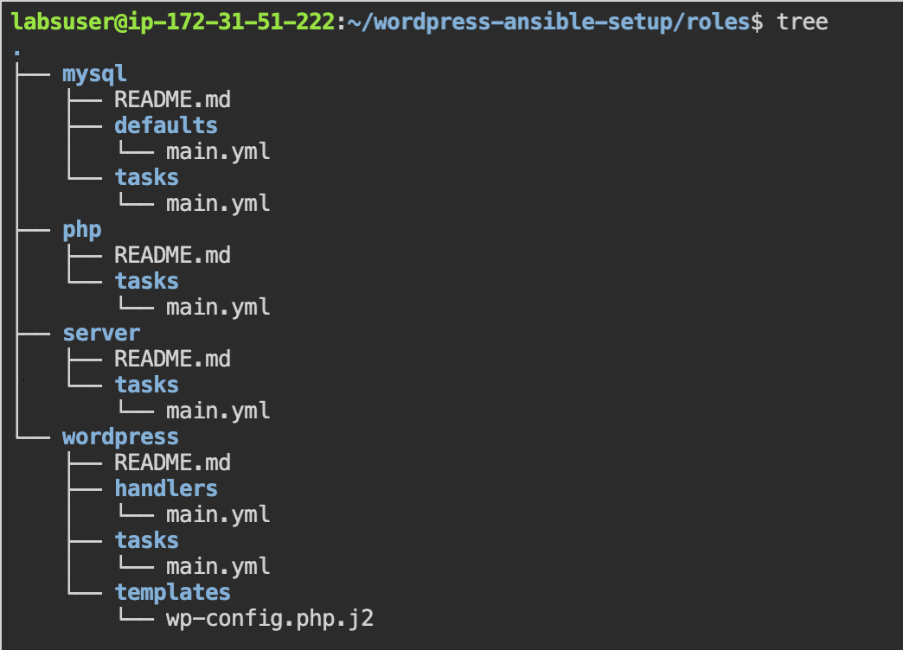
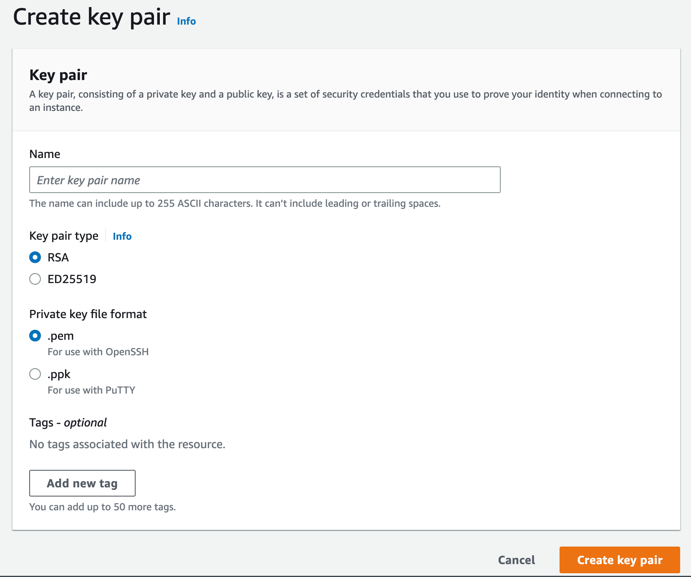
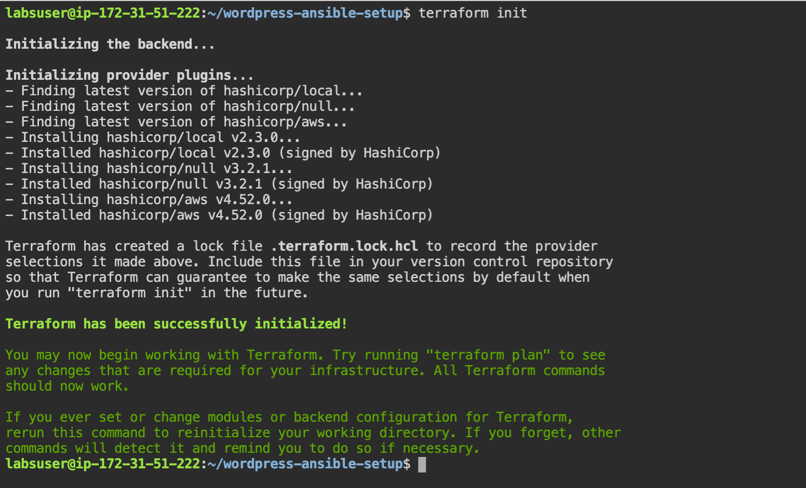
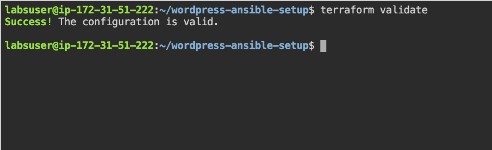
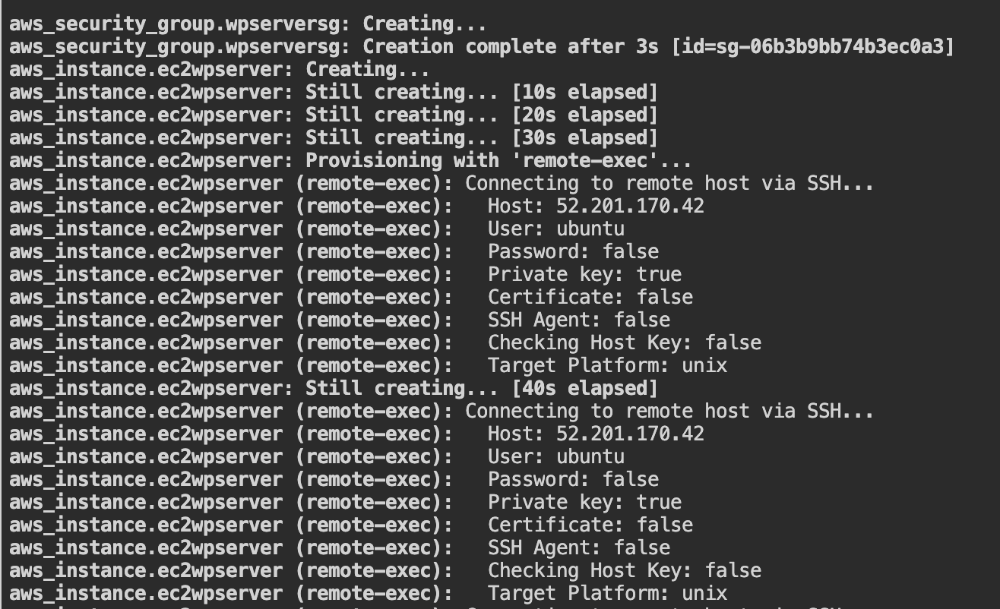
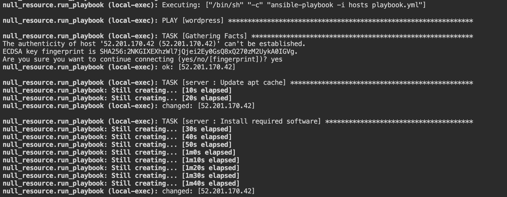
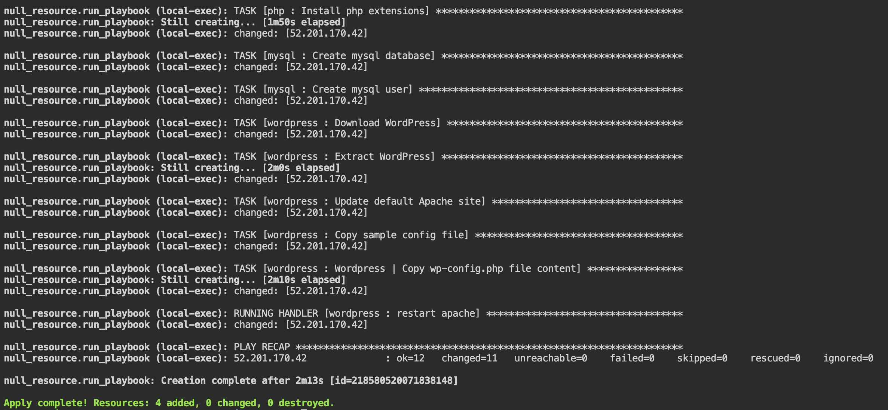
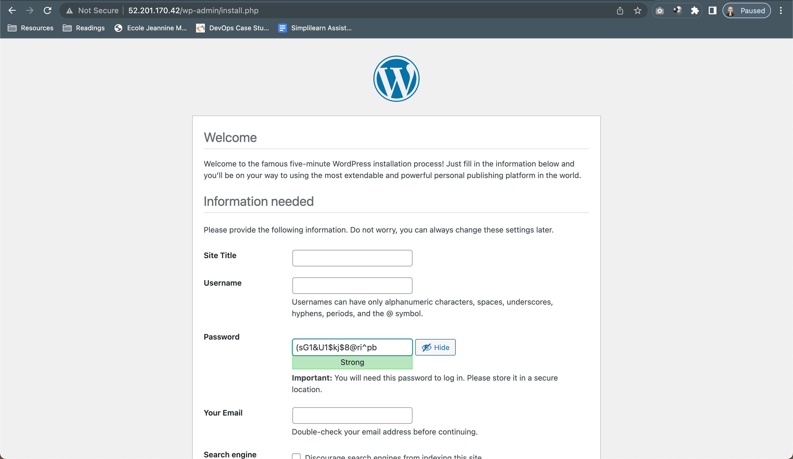
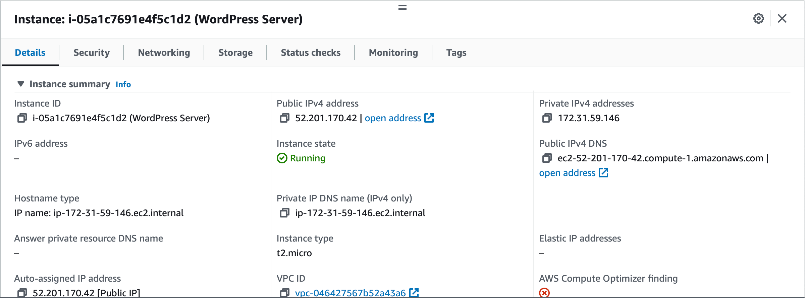

Note - This article will be updated to use Ansible Vault to pass sensitive variables using encryption. I will change this message once this is done.

## Introduction

In this project, we are going to provision an EC2 instance using Terraform and use Ansible to deploy a complete and working WordPress stack which can then be configured and installed using the web interface. As always with our projects, we will be using an Ubuntu based system.

## Pre-requisites

Since we are using Terraform, Ansible and AWS, we will be needing the following things in place before continuing.

1. Install the latest version of Terraform using the guide [here](https://developer.hashicorp.com/terraform/tutorials/aws-get-started/install-cli).
2. Install and configure Ansible using the guide [here](https://docs.ansible.com/ansible/latest/installation_guide/installation_distros.html#installing-ansible-on-ubuntu)
3. If you do not have an AWS account, create one now from [AWS](https://aws.amazon.com/)

First, we will create the Ansible stuff and make sure our playbook can deploy a WordPress server. Once this is done, we can automate this deployment on an EC2 instance with Terraform.

## Creating the Ansible Playbook & Roles

We will be manually creating the Ansible Roles to use in this tutorial. You can find many ready-to-use WordPress roles on Ansible-Galaxy but most of them tend to get too complicated very fast.

In this method, we will create the following Ansible Roles to manage various aspects of the WordPress installation process and before that, installing the dependencies.

### Which roles will we create?

WordPress → Main Role which will run the important tasks
MySQL → To setup our MySQL user and DB
PHP → To install dependencies required by WP
Server → To make sure our server is setup using the correct dependencies.

You can follow along this tutorial by manually creating the following files and folders, or you can clone my Git repository.

```
git clone https://github.com/codenamenuke/wordpress-ansible-setup.git
```

Create Folder, you can name it whatever you want.

```
mkdir wordpress-ansible-setup
```

Inside this folder, we will create the Ansible Roles structure.

```python
mkdir roles
```

 Inside the `roles` folder execute the following commands one by one.

```python
ansible-galaxy init php
ansible-galaxy init server
ansible-galaxy init mysql
ansible-galaxy init wordpress
```

Your `roles` folder should look similar to this. Don’t worry if there are many more files and folders, this screenshot is from the git repository where the unused folders were removed.



## Creating the YAML files for each role

Let’s now go through all the files we need to create.

### Server

From the main project folder, open the `main.yml` file inside the tasks folder of the server role.

```bash
nano roles/server/tasks/main.yml
```

```yaml
---
# Tasks file for Server Role

- name: Update apt cache
  apt: update_cache=yes cache_valid_time=3600
  become: yes

- name: Install required software
  apt:
    name: ['apache2', 'python3-dev', 'python3-pip', 'mysql-server', 'php-mysql', 'php', 'libapache2-mod-php', 'python3-mysqldb']
    state: present
  become: yes
```

### MySQL

```bash
nano roles/mysql/tasks/main.yml
```

```yaml
---
# Tasks file for MySQL Role

- name: Create mysql database
  mysql_db:
    name: '{{ wp_mysql_db }}'
    state: present
  become: yes

- name: Create mysql user
  mysql_user:
    name: '{{ wp_mysql_user }}'
    password: '{{ wp_mysql_password }}'
    priv: '*.*:ALL'
  become: yes
```

The MySQL role will also have the defaults stored which will be used when there are no variables passed.

```bash
nano roles/mysql/defaults/main.yml
```

```yaml
---
# Defaults file for MySQL Role

wp_mysql_db: wordpress
wp_mysql_user: wordpress
wp_mysql_password: randompassword
```

Now, let’s create the PHP role which will install some dependencies for our WordPress server.

```bash
nano roles/php/tasks/main.yml
```

```yaml
---
# Tasks file for PHP Role
- name: Install php extensions
  apt:
    pkg: ['php-gd', 'php-ssh2']
    state: present
  become: yes
```

And finally, let’s create our main role, Wordpress.

```bash
nano roles/wordpress/tasks/main.yml
```

```yaml
---
# Tasks file for WordPress Role
- name: Download WordPress
  get_url:
    url: 'https://wordpress.org/latest.tar.gz'
    dest: '/tmp/wordpress.tar.gz'
    validate_certs: no

- name: Extract WordPress
  unarchive:
    src: '/tmp/wordpress.tar.gz'
    dest: '/var/www/html'
    copy: no
  become: yes

- name: Update default Apache site
  become: yes
  lineinfile:
    dest=/etc/apache2/sites-enabled/000-default.conf
    regexp="(.)+DocumentRoot /var/www/html"
    line="DocumentRoot /var/www/html/wordpress"
  notify:
    - restart apache

- name: Copy sample config file
  command: mv /var/www/html/wordpress/wp-config-sample.php /var/www/html/wordpress/wp-config.php creates=/var/www/html/wordpress/wp-config.php
  become: yes

- name: Wordpress | Copy wp-config.php file content
  become: yes
  template:  
    src: wp-config.php.j2
    dest: "/var/www/html/wordpress/wp-config.php"
```

We will create a handler that will restart the apache2 server after updating the default Apache site

```yaml
nano roles/wordpress/handlers/main.yml
```

```yaml
---
# handlers file for wordpress

- name: restart apache
  service:
    name: 'apache2'
    state: restarted
  become: yes
```

And finally, we will create a Jinja2 template exactly like the default WordPress `wp-config.php` file. We will pass our MySQL variable data through this template into our final WP installation.

```yaml
nano roles/wordpress/templates/wp-config.php.j2
```

```yaml
# This is a replica of the entire wp-config.php default file, so for the sake of brevity, we will just show the initial part where we will replace our variables.

// ** Database settings - You can get this info from your web host ** //
/** The name of the database for WordPress */
define( 'DB_NAME', '{{ wp_mysql_db }}' );
  
/** Database username */
define( 'DB_USER', '{{ wp_mysql_user }}' );
 
/** Database password */
define( 'DB_PASSWORD', '{{ wp_mysql_password }}' );
 
/** Database hostname */
define( 'DB_HOST', 'localhost' );
   
/** Database charset to use in creating database tables. */
define( 'DB_CHARSET', 'utf8' );

/** The database collate type. Don't change this if in doubt. */
define( 'DB_COLLATE', '' );
```

Please make sure you copy the entire `wp-config.php` file contents into the templates file and only change the Database name, user and password.

This concludes our Ansible setup that will install and configure WordPress and the require dependencies and the MySQL server.

## AWS Setup

To be able to use Terraform, we will need an EC2 Keypair which we will create from the EC2 dashboard. It is a very simple process and should take less than a minute.

Go to the EC2 Dashboard and scroll down on the left menu and click on Key Pairs. Click on Create Key Pair. You should see a page like this.



Keep the default settings. Name your key pair file as `wpserver` (this is the name we have used in the TF script. You can name it anything, just make sure you replace it in the TF script) and click on Create Key Pair at the bottom. This will download a file called `wpserver.pem`. This is your key pair file. If you are working on the same machine, you can give the path of this key pair file in the Terraform configuration. If you are working on a VM or a lab machine, do as follows:

1. Open the `wpserver.pem` file in a text editor like Notepad or Text Edit.
2. Copy the contents ENTIRELY. Including the BEGINNING OF RSA KEY and END OF RSA KEY.
3. In your VM/lab machine, inside the main project folder, create a new file with the same name.
   
    ```yaml
    nano wpserver.pem
    ```
    
4. Paste the contents inside the nano editor and save the file. (`ctrl + x + y` to save files in nano.)

### Setting Permissions for the key pair file

This is an important step. Without this, AWS will reject the SSH connection to the EC2 instance. While inside your main project folder, change the file permissions of the `wpserver.pem` file to 400.

```yaml
sudo chmod 400 wpserver.pem
```

We are now ready to setup Terraform.

## Setting Up Terraform

Create a new file in the project directory called `main.tf` in which we will write the Terraform code.

```yaml
nano main.tf
```

```yaml
# Main Terraform configuration file

# Define the local variables for the root module
locals {
  ami_id = "ami-08fdec01f5df9998f"
  vpc_id = "<your_vpc_id>"
  ssh_user = "ubuntu"
  key_name = "wpserver"
  private_key_path = "${path.module}/wpserver.pem"
}

# Uses the AWS provider to setup access
provider "aws" {
  access_key = "<your_access_key>"
  secret_key = "<your_secret_key>"
  token = ""
  region = ""
}

# Creates the EC2 Security Group with Inbound and Outbound rules.
resource "aws_security_group" "wpserversg" {
  name = "wpserversg"
  vpc_id = local.vpc_id
	
	# This will allow us to access the HTTP server on Port 80, where our WP will be accessible.
  ingress {
    from_port = 80
    to_port = 80
    protocol = "tcp"
    cidr_blocks = ["0.0.0.0/0"]
  }

	# This will allow us to SSH into the instance for Ansible to do it's magic.
  ingress {
    from_port = 22
    to_port = 22
    protocol = "tcp"
    cidr_blocks = ["0.0.0.0/0"]
  }

  egress {
    from_port = 0
    to_port = 0
    protocol = "-1"
    cidr_blocks = ["0.0.0.0/0"]
  }
}

# This creates the EC2 instance and makes an initial SSH connection.
resource "aws_instance" "ec2wpserver" {
  ami = local.ami_id
  instance_type = "t2.micro"
  associate_public_ip_address = true
  vpc_security_group_ids = [aws_security_group.wpserversg.id]
  key_name = local.key_name

  tags = {
    Name = "WordPress Server"
  }

  connection {
    type = "ssh"
    host = self.public_ip
    user = local.ssh_user
    private_key = file(local.private_key_path)
    timeout = "4m"
  }

  provisioner "remote-exec" {
    inline = [
      "touch /home/ubuntu/demo-file-from-terraform.txt"
    ]
  }
}

# Creating a local hosts file for Ansible to use
resource "local_file" "hosts" {
  content = templatefile("${path.module}/templates/hosts",
    {
      public_ipaddr = aws_instance.ec2wpserver.public_ip
      key_path = local.private_key_path
      ansible_user = local.ssh_user
    }
  )
  filename = "${path.module}/hosts"
}

# We will use a null resource to execute the playbook with a local-exec provisioner.

resource "null_resource" "run_playbook" {
  depends_on = [

    # Running of the playbook depends on the successfull creation of the EC2
    # instance and the local inventory file.

    aws_instance.ec2wpserver,
    local_file.hosts,
  ]

  provisioner "local-exec" {
    command = "ansible-playbook -i hosts playbook.yml"
  }
}
```

This Terraform script will create the EC2 instance and get the public IP of the instance and populate it in an Ansible hosts file called `hosts` which will reside in the main project folder. In order for this file to be formatted in the Ansible readable inventory, we will use templating. In the main project folder, create a directory called `templates`.

```yaml
mkdir templates
```

Now, let’s create the hosts inventory template inside this directory.

```yaml
nano templates/hosts
```

And this is how our hosts file will look like.

```ini
[wordpress]
${public_ipaddr}

[wordpress:vars]
ansible_ssh_user = ubuntu
ansible_ssh_private_key_file = ${key_path}
```

Since we have used the host as `wordpress` in our playbooks, we will use the same hostgroup name here.

We now have the Terraform setup ready to provision. The only things left now are to complete the Terraform flow.

### Terraform Flow

The first step is to do `terraform init`. This will initiate all the plugins required by Terraform to execute our resources. We execute these commands in the main project folder.

```yaml
terraform init
```

If all the configuration is correct, you should see a message like this.



As we can see, Terraform has installed the plugins local, null and aws.

The next step is to validate our configuration. To do this we will do `terraform validate`. Terraform will parse through our code and verify if all the syntax and dependencies check out.

```yaml
terraform validate
```

We should now see a success message from Terraform.



You could further check your configuration by performing `terraform plan`. This will show you what all changes will made and what resources will be provisioned, without actually applying the changes. For the purpose of this tutorial, we will skip this step and go directly to the final step.

```yaml
terraform apply
```

Terraform will now begin provisioning the resources.



Once Terraform is done provisioning the EC2 instance and populating our local inventory file, it will execute the Ansible playbook which will then do what is required to deploy our WordPress server on the EC2 instance.



And once all the executions are complete, we should see a screen like this.



The above screenshot shows what is the IP address of our new instance. `52.201.170.42`. This is the address where we will find our WordPress initial setup screen. Go to the browser and type the IP inside the address bar and press enter. You should see the WordPress setup screen.



This is the end goal of this tutorial. However, let’s just go ahead and verify everything from our EC2 dashboard too.

Here are the details of our instance in the EC2 dashboard.


