## Introduction

In this article, we will look at how we can deploy an app using a CI/CD pipeline involving git, GitHub, Jenkins, Docker and DockerHub. The basic premise is that when a code update is pushed to git, it will get updated on GitHub. Jenkins will then pull this update, build the Docker Image from a Dockerfile and Jenkinsfile configuration, push it to Docker Hub as a registry store, and then pull it and run it as a container to deploy our app.

## Prerequisites

1.	We will use a Python app for this tutorial. The sample app will be included in the GitHub repo.
2. GitHub account to sync our local repo and connect with Jenkins.
3. Docker Hub account. If you do not already have one, you can create it at hub.docker.com

> This article uses Ubuntu 16.04 Bionic Beaver. You can achieve all the steps mentioned here using Vagrant and VirtualBox. You can follow the tutorial here.

## Installing/Updating Java

First we will check if Java is installed and what version is it.

```bash
java -version
```
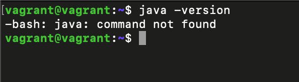

As you can see, it shows Java is not installed. 

Since Jenkins will require Java 11, we will go ahead install it using the official documentation of Jenkins.

```bash
sudo apt-get install -y openjdk-11-jre
```
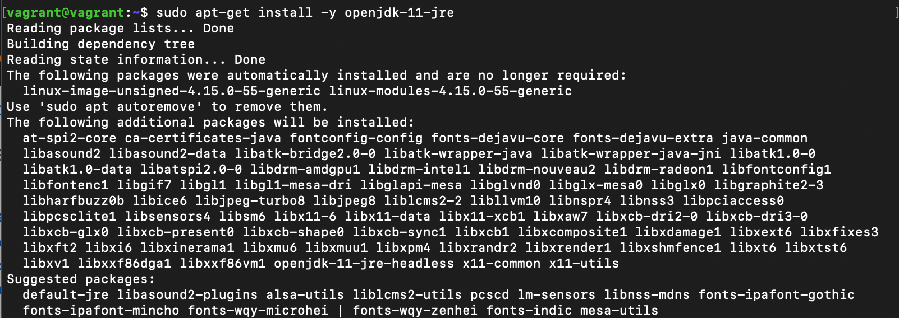

Once the installation is complete, you can now check and verify the java version again.

```bash
java -version
```
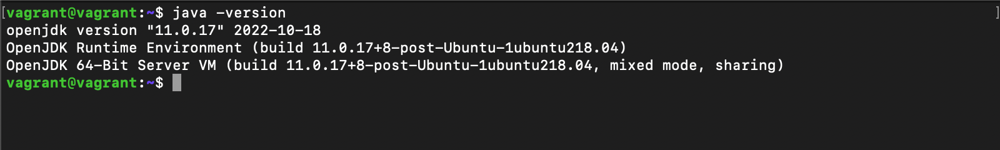

As we can see, Java is now successfully installed with version 11.0.17.

Now, let's install Git.

## Installing Git

Git will help us in maintaining and versioning our code in an efficient manner.

First let us check if Git is already available in our system or not.

```bash
git --version
```
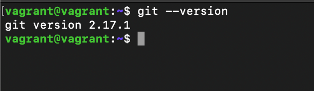

As we can see, Git was already installed on the system with the version 2.17.1. If you still do not have it installed, you can install it using this command:

```bash
sudo apt-get install -y git
```

## Configuring Git (Local Repo)

Let's first create a folder for our project. We will be working inside this folder throughout the tutorial.

```bash
mkdir pythonapp
```
We will initialize our local Git repository inside this folder.

```bash
cd pythonapp
```
But before we initialize our local repository, we need to make some changes to the default Git configuration. 

```bash
git config --global init.defaultBranch main
```
By default, Git uses 'master' as the default branch. However, GitHub and most developers like to use 'main' as the default branch.

Further, we will also configure our name and email ID for Git.

```bash
git config --global user.name "your_name"
git config --global user.email "your@email.com"
```

To verify your modifications to the Git configuration, you can use this command:

```bash
git config --list
```
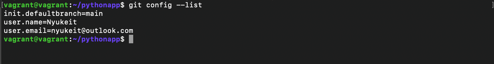

Now it's time to initialize our local repository.

```bash
git init
```
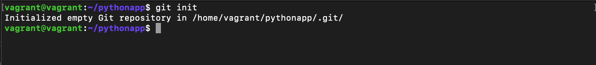

This will create an empty repository in the folder. You can also alternatively create a repository on GitHub first and then clone it to your local system.

## Setting up GitHub (Remote Repo)

Our local Git repository is not setup and initialized. We will now create a remote repo on GitHub to sync with local.

Login to your GitHub account and click on your Profile picture. Click on 'Your Repositories'.

On the page that opens, click on the green 'New' button.

Let's name our repo 'pythonapp' to keep it same as our folder name. This is not necessary but it will keep things simpler.

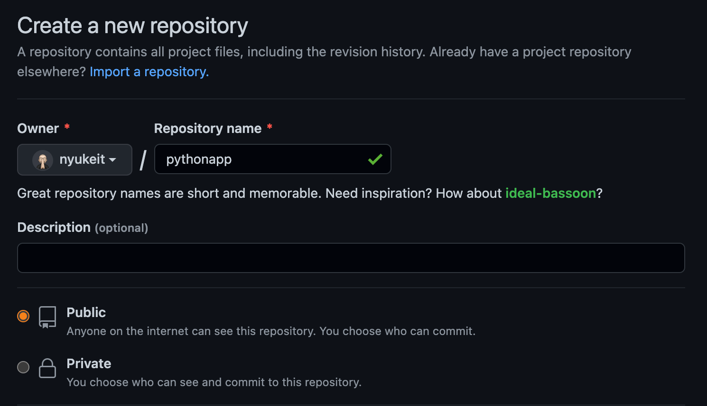

Keep the repository as 'Public' and click on 'Create Repository'

## Connecting to GitHub

For this tutorial, we will use SSH to connect the local repo to our remote repo. Please note that GitHub has stopped allowing username/password combinations for connections. If you wish to use https instead, you can check out [this](https://www.edgoad.com/2021/02/using-personal-access-tokens-with-git-and-github.html) tutorial to connect using Personal Access Tokens.

First we will create an SSH key in our Ubuntu system.

```bash
ssh-keygen
```
Press 'enter' three times without typing anything.

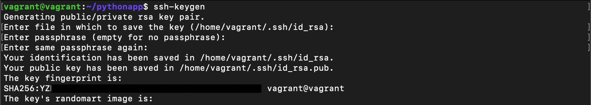

This will create an SSH key in your system. We will use this key in our GitHub account. To access the key, use this command

```bash
cat ~/.ssh/id_rsa.pub
```
Copy the entire key.

On GitHub, go to your repository and click on 'Settings'.

On the left, in the 'Security' section, click on 'Deploy Keys'.

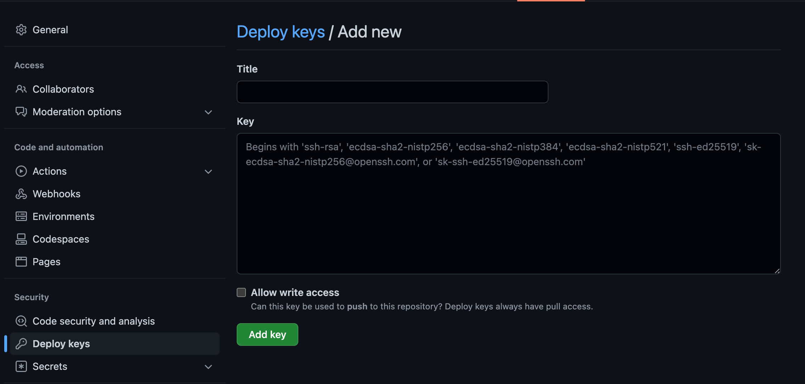

Name the key to whatever you wish. Paste the key that you copied from the terminal inside the 'Key' box. Be sure to tick the 'Allow Write Access' box.

Now click on 'Add Key'. We now have access to push to our remote repo using SSH.

Now we will add the remote that will allow us to perform operations to the remote repo.

```bash
git remote add origin git@github.com:nyukeit/pythonapp.git
```
To verify your remote

```bash
git remote
```
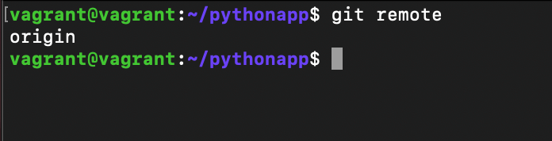

To verify and connect our configuration, we will do 

```bash
ssh -T git@github.com
```
When prompted, type 'yes'. You should see a message that says 'You have successfullly authenticated, but GitHub does not provide shell access.'

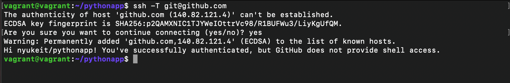

## Python App

Let's create Python app that will display Hello World! in the browser when executed. 

Inside your terminal, make sure you are in the project folder. Create a folder named 'src' and create a file name 'helloworld.py' inside this folder like this:

```bash
mkdir src
cd src
```

```bash
sudo nano helloworld.py
```
Now let's write a Python script! Inside the nano editor, type this:

```python3
from flask import Flask, request
from flask_restful import Resource, Api

app = Flask(__name__)
api = Api(app)

class Greeting (Resource):
    def get(self):
        return 'Hello World!'

api.add_resource(Greeting, '/') # Route_1

if __name__ == '__main__':
    app.run('0.0.0.0','3333')
```
Press **ctrl + x + y** to save the file.

Head over to [Part 2](https://nyukeit.dev/posts/docker-jenkins-pipeline-part2/) where we will go through the installation & configuration of Jenkins, Docker and creating the scripts to finish our pipeline.