This is a continuation of the tutorial for building a Docker Jenkins pipeline to deploy a simple Python app using Git and GitHub. The first part of the tutorial can be found [here](https://devopsnuke.netlify.app/posts/docker-jenkins-ci-cd-pipeline-part1/).

## Installing Jenkins

We now have the basics ready for deploying our app. Let's install the remaining software to complete our pipeline.

We begin by importing the GPG key which will verify the integrity of the package.

```bash
curl -fsSL https://pkg.jenkins.io/debian-stable/jenkins.io.key | sudo tee \
  /usr/share/keyrings/jenkins-keyring.asc > /dev/null
```
Next, we add the Jenkins softwarey repository to the sources list and provide the authentication key.

```bash
echo deb [signed-by=/usr/share/keyrings/jenkins-keyring.asc] \
  https://pkg.jenkins.io/debian-stable binary/ | sudo tee \
  /etc/apt/sources.list.d/jenkins.list > /dev/null
```

```bash
sudo apt update
```
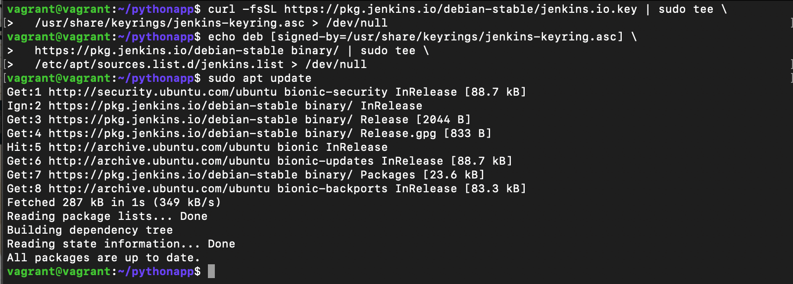

Now, we install Jenkins

```bash
sudo apt-get install -y jenkins
```
Wait till the entire installation process is over and you get back control of the terminal.

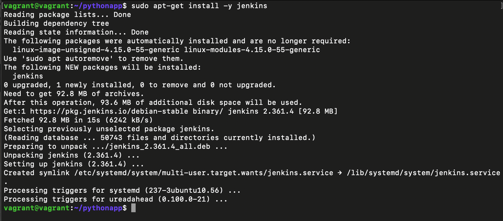

To verify if Jenkins was installed correctly, we will check if the Jenkins service is running.

```bash
sudo systemctl status jenkins.service
```
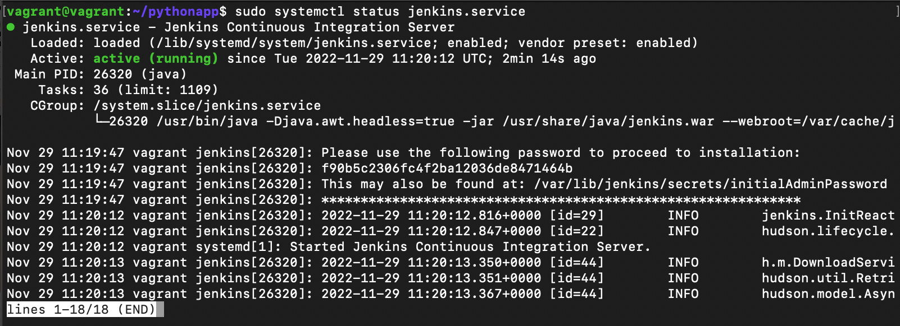

Press **Q** to regain control.

## Jenkins Configuration

We have verified that the Jenkins service is now running. This means we can go ahead and configure it using our browser.

Open your browser and type this in the address bar:

```bash
localhost:8080
```
You should see the Unlock Jenkins page. 

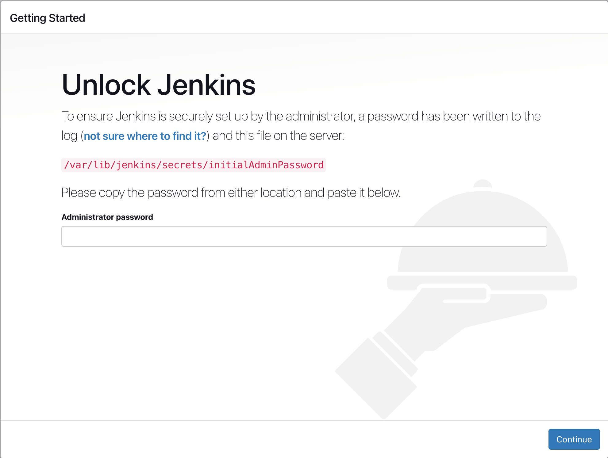

Jenkins generated a default password when we installed it. To locate this password we will use the command:

```bash
sudo cat /var/lib/jenkins/secrets/initialAdminPassword
```


Copy this password and paste it into the box on the welcome page.

On the next page, select 'Install Suggested plugins'

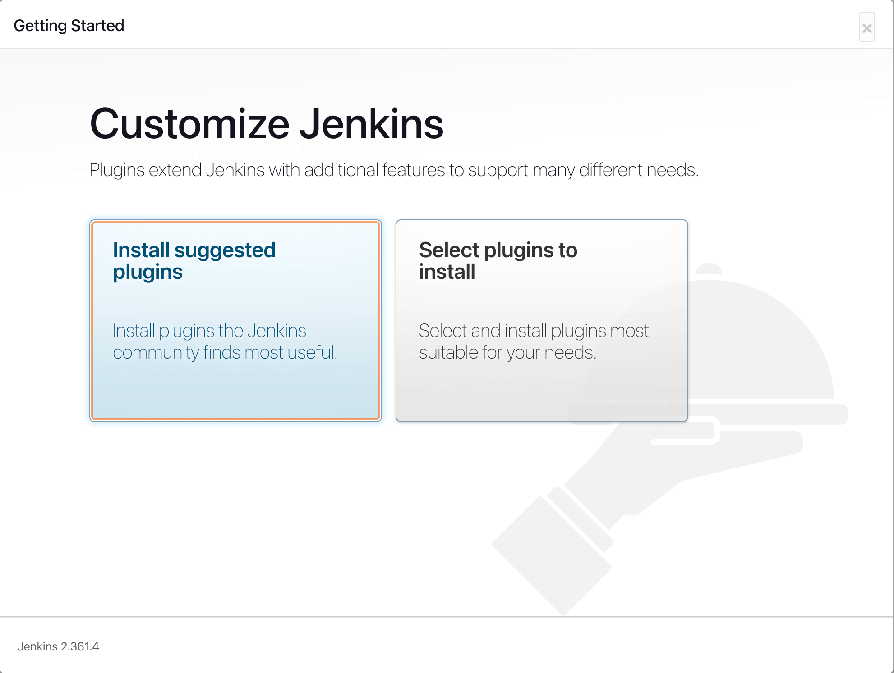

Once the installation has completed, click on Continue.

On the Create Admin User page, click 'Skip and Continue as Admin'. You can alternatively create a separate Admin user, but be sure to add it to Docker group.

Click on 'Save and Continue'

On the **Instance Configuration** page, Jenkins will show the URL where it can be accessed. Leave it and click 'Save and Finish'

Click on 'Start Using Jenkins'. You will land on a welcome page like this:

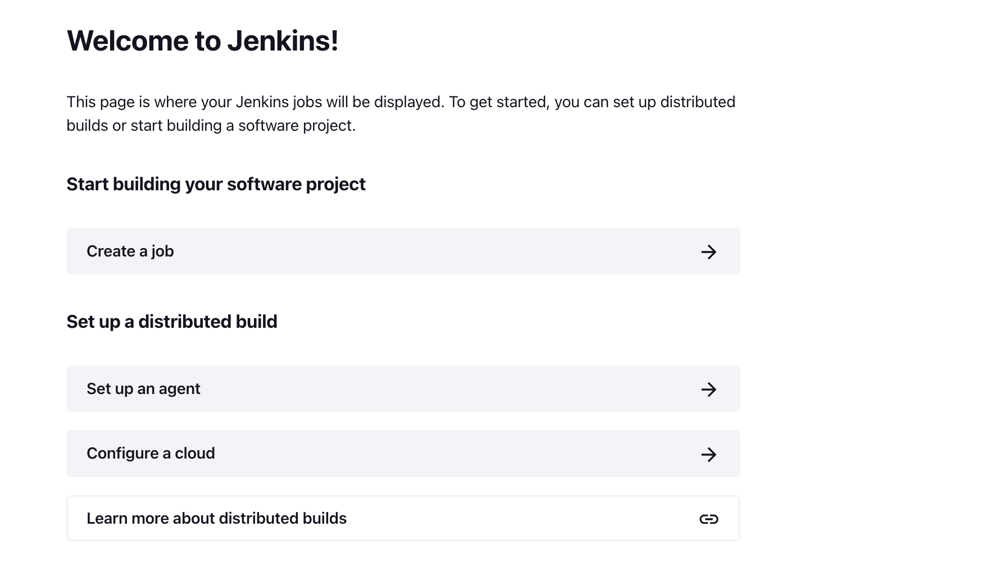

We have now successfully setup Jenkins. Let's go back to the terminal to install Docker.

## Installing Docker

First we need to uninstall any previous Docker stuff, if any.

```bash
sudo apt-get remove docker docker-engine docker.io containerd runc
```
Most likely, nothing will be removed since we are working with a fresh install of Ubuntu.

We will use the command line to install Docker.

```bash
sudo apt-get install \
    ca-certificates \
    curl \
    gnupg \
    lsb-release
```


Next, we will add Docker's GPG key, just like we did with Jenkins.

```bash
sudo mkdir -p /etc/apt/keyrings
```
```bash
curl -fsSL https://download.docker.com/linux/ubuntu/gpg | sudo gpg --dearmor -o /etc/apt/keyrings/docker.gpg
```
Now, we will setup the repository

```bash
echo \
  "deb [arch=$(dpkg --print-architecture) signed-by=/etc/apt/keyrings/docker.gpg] https://download.docker.com/linux/ubuntu \
  $(lsb_release -cs) stable" | sudo tee /etc/apt/sources.list.d/docker.list > /dev/null
```
Next we will install the Docker Engine.

```bash
sudo apt-get update
```

```bash
sudo apt-get install docker-ce docker-ce-cli containerd.io docker-compose-plugin
```


Now verify the installation by typing

```bash
docker version
```


Notice that you will get an error for permission denied while connecting to Docker daemon socket. This is because it requires a root user. This means you would need to prefix sudo every time you want to run Docker commands. This is not ideal. We can fix this by making a docker group.

```bash
sudo groupadd docker
```
The docker group may already exist. Now let's add the user to this group.

```bash
sudo usermod -aG docker $USER
```
Apply changes to Unix groups by typing the following:

```bash
newgrp docker
```
> Note: If you are following this tutorial on a VM, you may need to restart your instance for changes to take effect.

Let's verify that we can now connect to the Docker Engine.

```bash
docker version
```
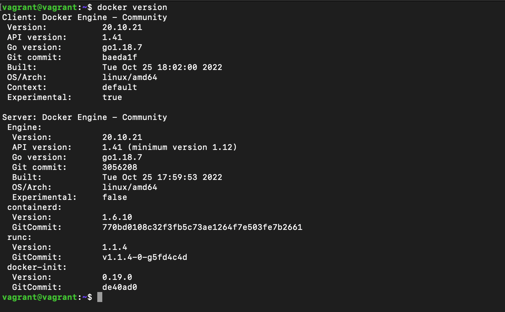

As we can see, Docker is now fully functional with a connection to the Docker Engine.

We will now create the Dockerfile that will build the Docker image.

## Creating the Dockerfile

Inside your terminal, within your folder, create the Dockerfile using the nano editor.

```bash
sudo nano Dockerfile
```
Type this text inside the editor:

```bash
FROM python:3.8
WORKDIR /src
COPY . /src
RUN pip install flask
RUN pip install flask_restful
EXPOSE 3333
ENTRYPOINT ["python"]
CMD ["./src/helloworld.py"]
```

## Building the Docker Image

From the Dockerfile, we will now build a Docker image.

```bash
docker build -t helloworldpython .
```
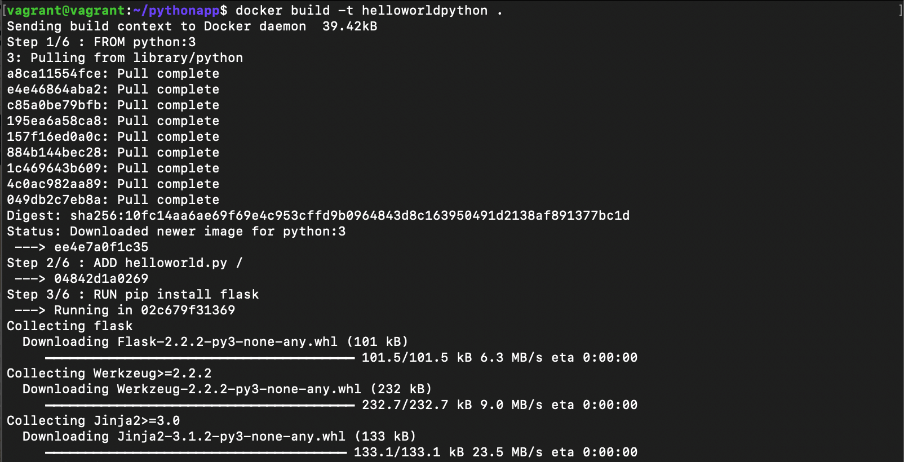

Now let's create a test container and run it a browser to check if our app is displaying correctly.

```bash
docker run -p 3333:3333 helloworldpython
```

Open your browser and go to ```localhost:3333``` to see our python app in action.


Now let's see how we can automate this printing every time we make a change to our python code.

## Creating the Jenkinsfile

We will create a Jenkinsfile which will elaborate a step-by-step process of building the image from the Dockerfile, pushing it to the registry, pulling it back from the registry and running it as a container.

Every change pushed to the GitHub repository will trigger this chain of events.

```bash
sudo nano Jenkinsfile
```
In the nano editor, we will use the following code as our Jenkinsfile.

```bash
node {
	def application = "pythonapp"
	def dockerhubaccountid = "nyukeit"
	stage('Clone repository') {
		checkout scm
	}

	stage('Build image') {
		app = docker.build("${dockerhubaccountid}/${application}:${BUILD_NUMBER}")
	}

	stage('Push image') {
		withDockerRegistry([ credentialsId: "dockerHub", url: "" ]) {
		app.push()
		app.push("latest")
	}
	}

	stage('Deploy') {
		sh ("docker run -d -p 3333:3333 ${dockerhubaccountid}/${application}:${BUILD_NUMBER}")
	}
	
	stage('Remove old images') {
		// remove old docker images
		sh("docker rmi ${dockerhubaccountid}/${application}:latest -f")
   }
}
```

## Explaining the Jenkinsfile

Our Jenkins pipeline is divided in 5 stages as you can see from the code.

- Stage 1 - Clones our Github repo
- Stage 2 - Builds our Docker image from the Docker File
- Stage 3 - Pushes the image to Docker Hub
- Stage 4 - Deploys the image as a container by pulling it from Docker Hub
- Stage 5 - Removes the old image to stop image pile up.

Now that our Jenkinsfile is ready, let's push all of our source code to GitHub.

## Pushing files to GitHub

First, let's check the status of our local repo.

```bash
git status
```

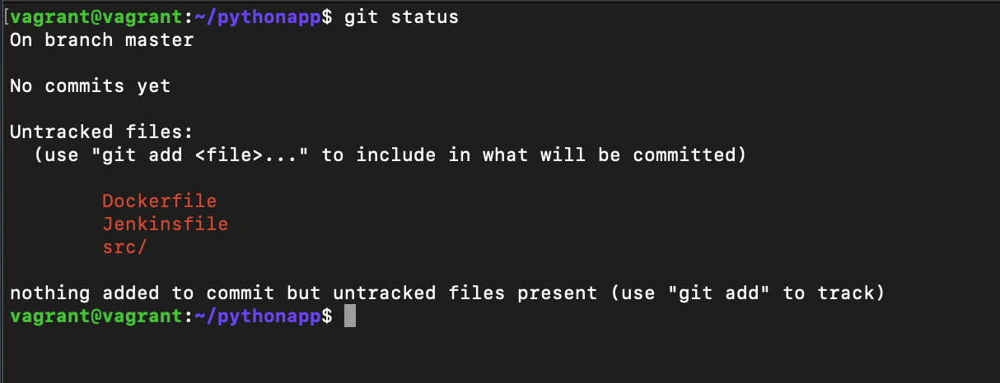

As we can see, there are no commits yet and there are untracked files and folders. Let's tell Git to track them so we can push them to our remote repo.

```bash
git add *
```
This will add all the files present in the git scope.

Git is now tracking our files and they are ready to be commit. The commit function pushes the files to the staging area where they will be ready to be pushed.

```bash
git commit -m "First push of the python app"
```


Now, it's time to push our files.

```bash
git push -u origin main
```
Let's go to our repo on GitHub to verify that our push was successful.

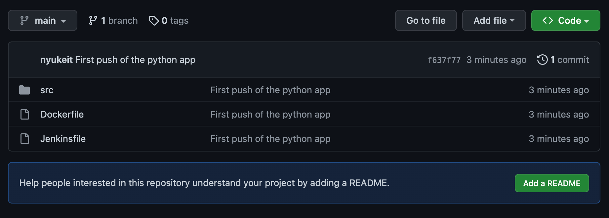

## Creating Jenkins Credentials

In the Jenkins dashboard, go to **Manage Jenkins**. 

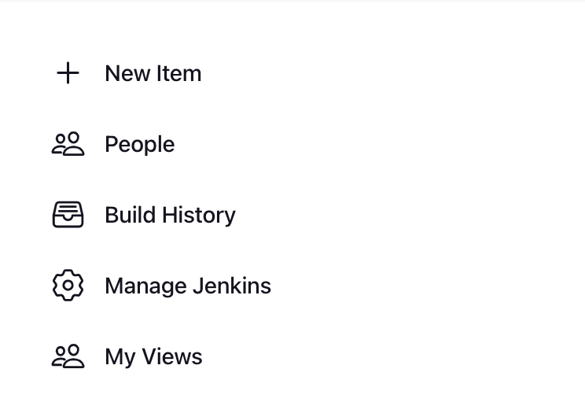

In the Security section, go to **Manage Credentials**.


In the credentials section, click on **System**. On the page that opens, click on **Global Credentials Unrestricted**

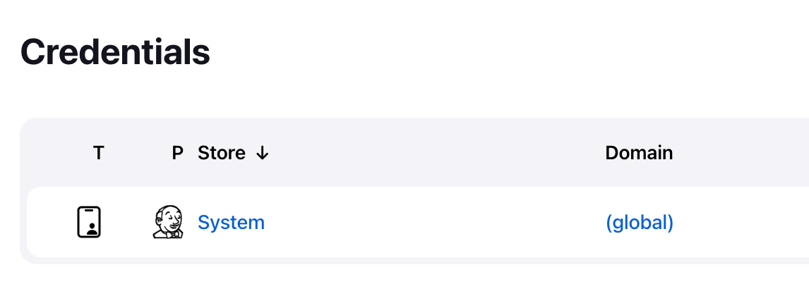
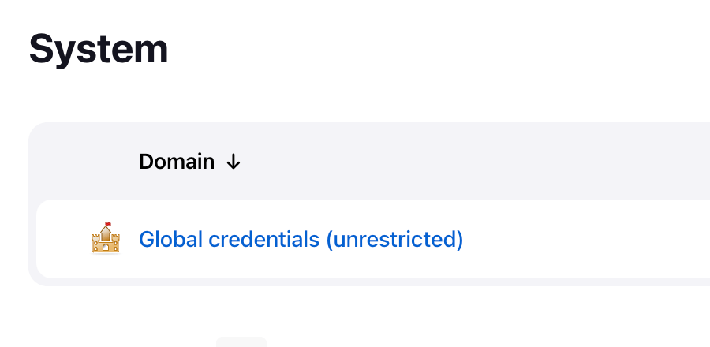

Now click on **Add Credentials**.

Keep 'Kind' as 'Username and Password'

In 'username' type your Docker Hub username.

In 'password' type your Docker Hub password.

> Note: If you have enabled 2FA in your Docker Hub account, you need to create an access token and use it as a password here.

In 'ID', type 'dockerHub'

Finally, click on **Create**

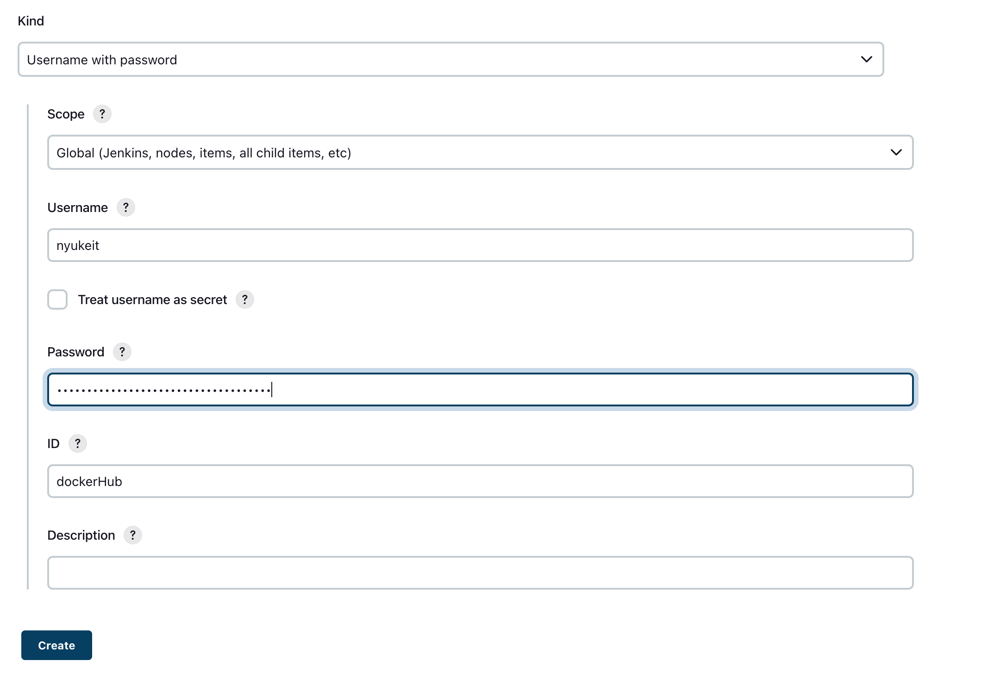

## Creating a Jenkins Job

To close our pipeline, we will create a Jenkins job which will be triggered when there are changes to our GitHub repo.

> Note: In Jenkins, if not already installed, install the plugins Docker and Docker Pipeline. Restart your Jenkins instance after installation.

Click on **New Item** in your Jenkins dashboard. Enter any name you like. Select **Pipeline** and click okay.

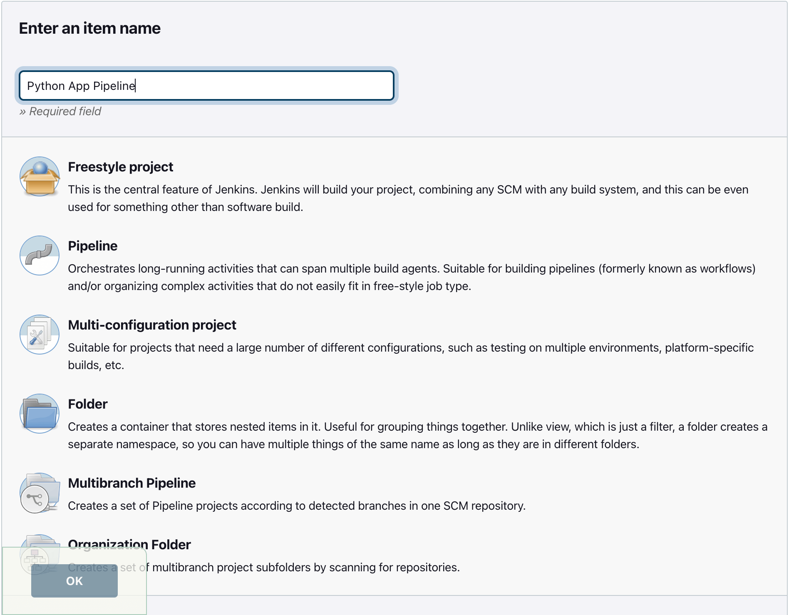

In the configuration page, type in any description that you want.

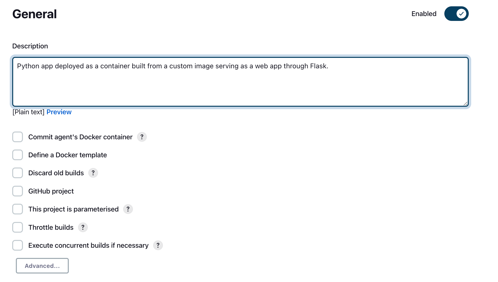

In 'Build Triggers' select **Poll SCM**.

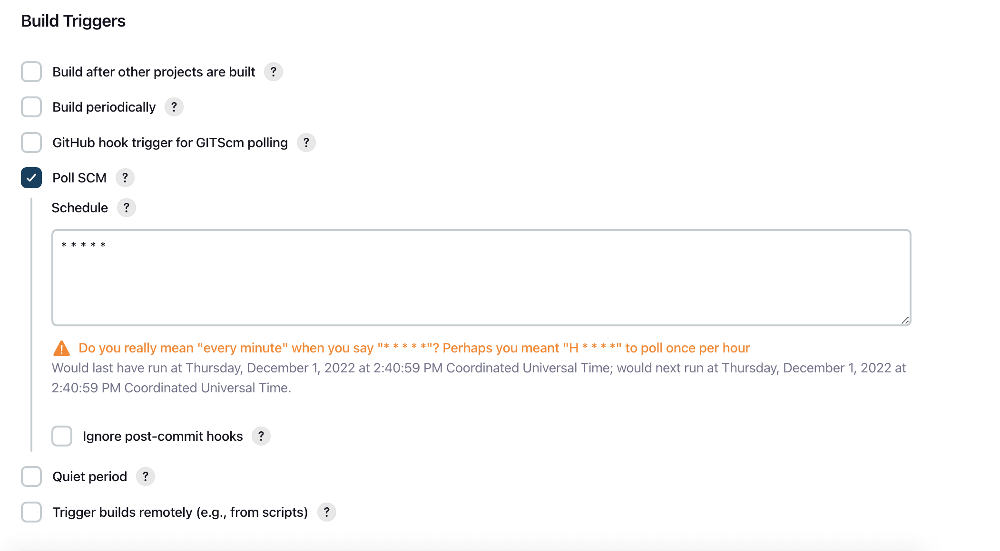

In 'Schedule', type ```* * * * *``` (with spaces in between. This will poll our GitHub repo every minute to check if there any changes. This is mostly too quick for any project, but we are just testing our code.

In the 'Pipeline' section, in 'definition' select **Pipeline Script from SCM**. This will look for the Jenkinsfile that we uploaded to our repo in GitHub and apply it.

Next, in SCM in the Repositories section, copy and paste your GitHub repo **HTTPS URL**.

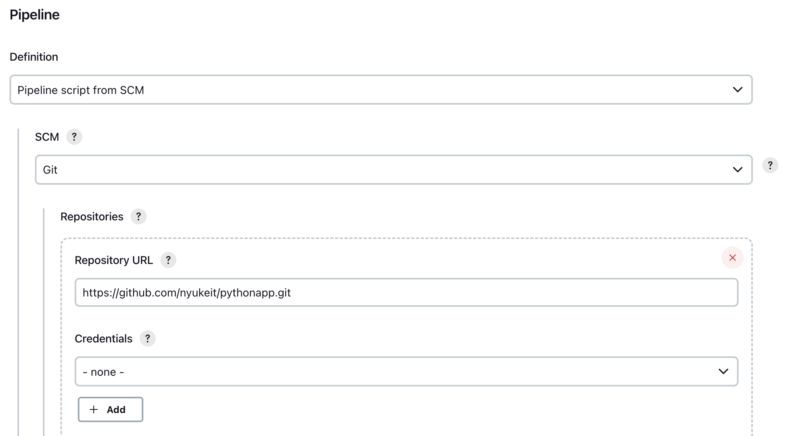

In 'Branches to Build', by default, it will have master. Change it to main, since our branch is called main.

Make sure the 'Script Path' has 'Jenkinsfile' already populated. If not, you can type it out.

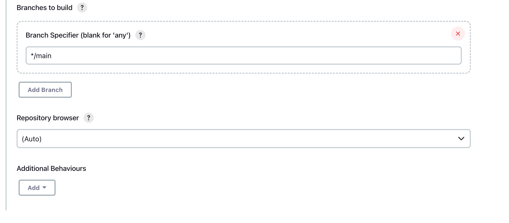

Click on **Save**. 

Now our Jenkins job is created. It is time to see the whole pipeline in action.

Click on 'Build Now'. This will trigger all the steps and if we have all the configurations correct, it should have our container running with the python app and our custom image uploaded on Docker Hub. Let's verify this.

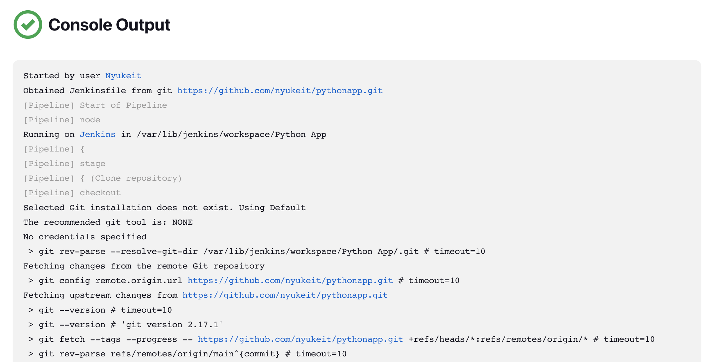

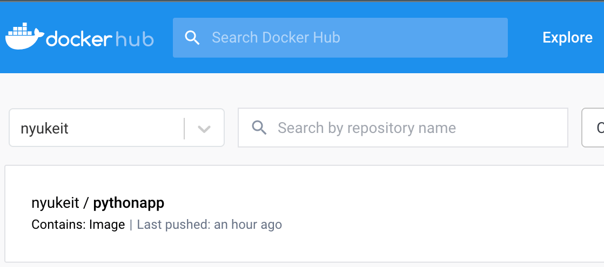

As we can see, our custom built image is now available in our Docker Hub account.

Now let's verify if the container is running.

```bash
docker ps
```

## Committing changes to Python App

To see the full automated flow in action, let's change the python app a bit and go back to our browser to see the changes being reflected automatically.

We have changed the output text from *Hello World!* to *Hello World! I am learning DevOps!*

Save the file and push the file to GitHub.

As we can see, this action triggered an automatic job creation on Jenkins, which resulted in Build No. 2 of our app.

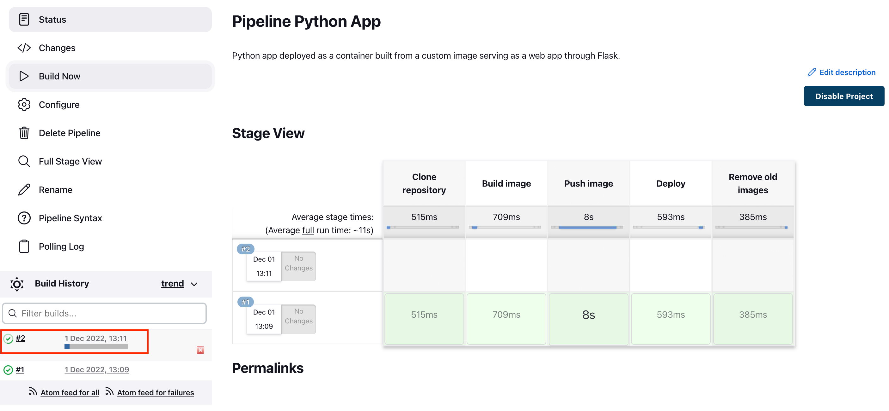

We can now see that our app has 2 builds. In the first build, we can see 'no changes' because we manually triggered the first build after creating our repository. All subsequent commits will result in a new build.

We can see that Build No 2 mentions there was 1 commit.

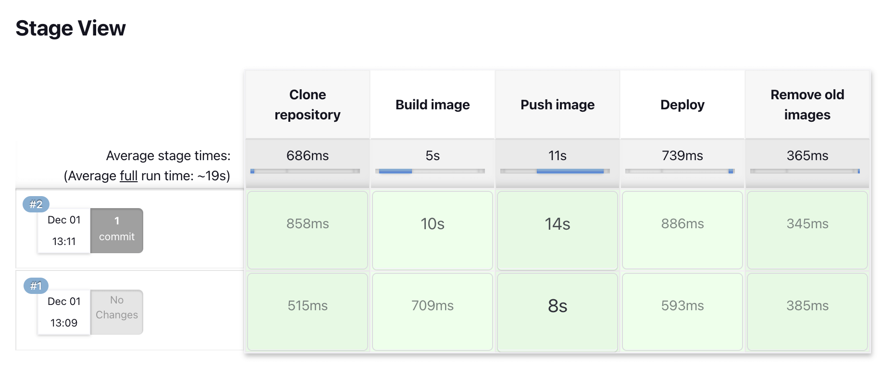

As for our webapp, the message displayed has now changed.

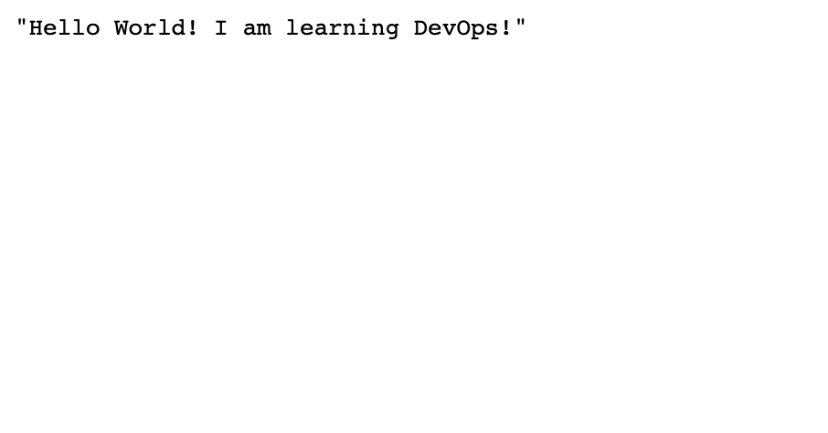

This is how we can create a Docker-Jenkins automation.


## Resources

[Installing Jenkins](https://www.jenkins.io/doc/book/installing/linux/#debianubuntu)

[Installing Docker on Ubuntu](https://docs.docker.com/engine/install/ubuntu/)

[Fix Docker Socket Permission Denied](https://www.digitalocean.com/community/questions/how-to-fix-docker-got-permission-denied-while-trying-to-connect-to-the-docker-daemon-socket)

[Dockerize your Python Application](https://runnable.com/docker/python/dockerize-your-python-application)

[Containerize A Python Application](https://www.section.io/engineering-education/how-to-containerize-a-python-application/)